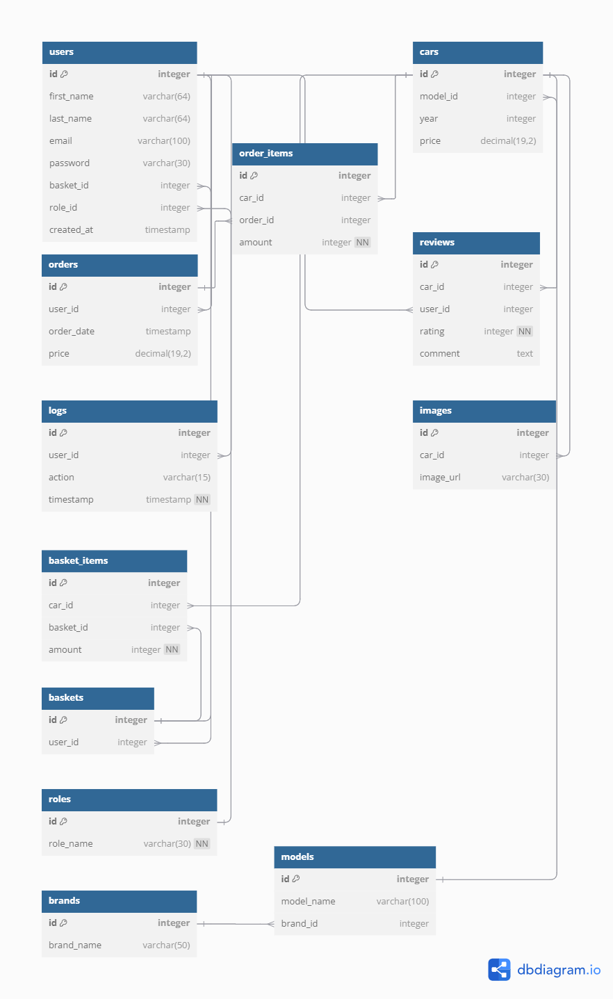

# Проект: Сайт продажи дилерских автомобилей
## Гулис Антон Александрович 
## 253505

## Информация о проекте
В данном проекте разрабатывается сайт, позволяющий пользователям покупать автомобили, а дилерам размещать свои. Проект будет включать функции управления пользователями, автомобилями и заказами.

## Гулис Антон Александрович

## 253505

## Функциональные требования
1. **Регистрация и авторизация пользователей**
Пользователь может зарегистрироваться, указав имя, фамилию, email и пароль.
Пользователь может авторизоваться с помощью email и пароля.
Администратор может создавать пользователей с различными ролями (например, клиент, дилер, администратор).
Пол**ьзователь может изменить свои данные (имя, фамилию, пароль).
2. **Роли и права доступа**
Администратор может создавать и управлять ролями пользователей.
В зависимости от роли, пользователи имеют разный уровень доступа:
Клиенты могут просматривать автомобили, делать заказы, оставлять отзывы.
Дилеры могут добавлять автомобили, редактировать и удалять свои предложения.
Администраторы могут управлять всеми пользователями, дилерами и автомобилями.
3. **Каталог автомобилей**
Пользователь может просматривать список автомобилей с возможностью фильтрации по марке, модели, цене и году выпуска.
Для каждого автомобиля отображаются его детали: марка, модель, год выпуска, цена, изображения.
Дилер может добавлять новые автомобили в каталог.
Дилер может редактировать и удалять информацию о своих автомобилях.
4. **Заказы и продажи**
Пользователь может оформить заказ на автомобиль.
После оформления заказа генерируется запись с датой заказа и данными пользователя.
Администратор и дилер могут просматривать список заказов.
Продажа автомобиля фиксируется в базе данных после подтверждения заказа, создавая запись о продаже.
5. **Отзывы и рейтинги**
Пользователь может оставить отзыв и поставить рейтинг автомобилю.
Рейтинг может быть от 1 до 5 звезд.
Отзывы отображаются на странице автомобиля и могут быть просмотрены всеми пользователями.
Администратор может удалять неуместные отзывы.
6. **История действий (логирование)**
Записываются все действия пользователей (авторизация, добавление автомобиля, создание заказа и т.д.).
Администратор может просматривать журнал действий.
7. **Фильтрация и поиск автомобилей**
Пользователь может фильтровать автомобили по цене, марке, модели, году выпуска и другим критериям.
Пользователь может сохранять свои фильтры для повторного использования.
8. **Изображения автомобилей**
Дилер может загружать изображения для автомобилей.
Для каждого автомобиля может быть загружено несколько изображений, которые отображаются в его карточке.
9. **Управление профилем дилеров**
Дилеры могут управлять своим профилем, включая возможность редактировать личные данные.
Администратор может назначать роли "дилер" существующим пользователям.
10. **Управление заказами**
Клиенты могут просматривать статус своих заказов.
Дилеры могут управлять статусом заказа (например, подтвердить или отменить заказ).
11. **Администрирование**
Администратор имеет доступ к управлению всеми данными (пользователи, дилеры, автомобили, заказы, отзывы).

## Перечень сущностей БД
```
CREATE TABLE IF NOT EXISTS public.basket_items
(
    id serial NOT NULL,
    car_id integer NOT NULL,
    basket_id integer NOT NULL,
    amount integer NOT NULL DEFAULT 1,
    CONSTRAINT basket_items_pkey PRIMARY KEY (id)
);

CREATE TABLE IF NOT EXISTS public.baskets
(
    id serial NOT NULL,
    user_id integer NOT NULL,
    CONSTRAINT baskets_pkey PRIMARY KEY (id),
    CONSTRAINT unique_user UNIQUE (user_id)
);

CREATE TABLE IF NOT EXISTS public.brands
(
    id serial NOT NULL,
    brand_name character varying(50) COLLATE pg_catalog."default" NOT NULL,
    CONSTRAINT brands_pkey PRIMARY KEY (id),
    CONSTRAINT unique_brand UNIQUE (brand_name)
);

CREATE TABLE IF NOT EXISTS public.cars
(
    id serial NOT NULL,
    model_id integer,
    price numeric(19, 2),
    year integer,
    CONSTRAINT cars_pkey PRIMARY KEY (id)
);

CREATE TABLE IF NOT EXISTS public.images
(
    id serial NOT NULL,
    car_id integer,
    image_url character varying(30) COLLATE pg_catalog."default" NOT NULL,
    description character varying(30) COLLATE pg_catalog."default",
    CONSTRAINT images_pkey PRIMARY KEY (id)
);

CREATE TABLE IF NOT EXISTS public.logs
(
    id serial NOT NULL,
    user_id integer NOT NULL,
    action character varying(20) COLLATE pg_catalog."default",
    "timestamp" timestamp without time zone NOT NULL DEFAULT CURRENT_TIMESTAMP,
    CONSTRAINT logs_pkey PRIMARY KEY (id)
);

CREATE TABLE IF NOT EXISTS public.models
(
    id serial NOT NULL,
    model_name character varying(100) COLLATE pg_catalog."default" NOT NULL,
    brand_id integer,
    CONSTRAINT models_pkey PRIMARY KEY (id)
);

CREATE TABLE IF NOT EXISTS public.order_items
(
    id serial NOT NULL,
    car_id integer NOT NULL,
    order_id integer NOT NULL,
    amount integer NOT NULL DEFAULT 1,
    CONSTRAINT order_items_pkey PRIMARY KEY (id)
);

CREATE TABLE IF NOT EXISTS public.orders
(
    id serial NOT NULL,
    user_id integer NOT NULL,
    order_date timestamp without time zone NOT NULL DEFAULT CURRENT_TIMESTAMP,
    price numeric(19, 2) NOT NULL,
    CONSTRAINT orders_pkey PRIMARY KEY (id)
);

CREATE TABLE IF NOT EXISTS public.reviews
(
    id serial NOT NULL,
    car_id integer NOT NULL,
    user_id integer NOT NULL,
    rating integer NOT NULL DEFAULT 3,
    comment text COLLATE pg_catalog."default",
    CONSTRAINT reviews_pkey PRIMARY KEY (id)
);

CREATE TABLE IF NOT EXISTS public.roles
(
    id serial NOT NULL,
    role_name character varying(30) COLLATE pg_catalog."default" NOT NULL DEFAULT 'user'::character varying,
    CONSTRAINT roles_pkey PRIMARY KEY (id),
    CONSTRAINT unique_name UNIQUE (role_name)
);

CREATE TABLE IF NOT EXISTS public.users
(
    id serial NOT NULL,
    first_name character varying(64) COLLATE pg_catalog."default" NOT NULL,
    last_name character varying(64) COLLATE pg_catalog."default" NOT NULL,
    email character varying(64) COLLATE pg_catalog."default" NOT NULL,
    password_hash character varying(100) COLLATE pg_catalog."default" NOT NULL,
    role_id integer NOT NULL,
    created_at timestamp without time zone DEFAULT CURRENT_TIMESTAMP,
    CONSTRAINT users_pkey PRIMARY KEY (id),
    CONSTRAINT unique_pass UNIQUE (password_hash),
    CONSTRAINT users_email_key UNIQUE (email),
    CONSTRAINT users_password_hash_key UNIQUE (password_hash)
);

ALTER TABLE IF EXISTS public.basket_items
    ADD CONSTRAINT basket_items_basket_id_fkey FOREIGN KEY (basket_id)
    REFERENCES public.baskets (id) MATCH SIMPLE
    ON UPDATE NO ACTION
    ON DELETE CASCADE;


ALTER TABLE IF EXISTS public.basket_items
    ADD CONSTRAINT basket_items_car_id_fkey FOREIGN KEY (car_id)
    REFERENCES public.cars (id) MATCH SIMPLE
    ON UPDATE NO ACTION
    ON DELETE CASCADE;


ALTER TABLE IF EXISTS public.baskets
    ADD CONSTRAINT baskets_user_id_fkey FOREIGN KEY (user_id)
    REFERENCES public.users (id) MATCH SIMPLE
    ON UPDATE NO ACTION
    ON DELETE CASCADE;
CREATE INDEX IF NOT EXISTS unique_user
    ON public.baskets(user_id);


ALTER TABLE IF EXISTS public.cars
    ADD CONSTRAINT cars_model_id_fkey FOREIGN KEY (model_id)
    REFERENCES public.models (id) MATCH SIMPLE
    ON UPDATE NO ACTION
    ON DELETE NO ACTION;


ALTER TABLE IF EXISTS public.images
    ADD CONSTRAINT images_car_id_fkey FOREIGN KEY (car_id)
    REFERENCES public.cars (id) MATCH SIMPLE
    ON UPDATE NO ACTION
    ON DELETE CASCADE;


ALTER TABLE IF EXISTS public.logs
    ADD CONSTRAINT logs_user_id_fkey FOREIGN KEY (user_id)
    REFERENCES public.users (id) MATCH SIMPLE
    ON UPDATE NO ACTION
    ON DELETE NO ACTION;


ALTER TABLE IF EXISTS public.models
    ADD CONSTRAINT models_brand_id_fkey FOREIGN KEY (brand_id)
    REFERENCES public.brands (id) MATCH SIMPLE
    ON UPDATE NO ACTION
    ON DELETE NO ACTION;


ALTER TABLE IF EXISTS public.order_items
    ADD CONSTRAINT order_items_car_id_fkey FOREIGN KEY (car_id)
    REFERENCES public.cars (id) MATCH SIMPLE
    ON UPDATE NO ACTION
    ON DELETE NO ACTION;


ALTER TABLE IF EXISTS public.order_items
    ADD CONSTRAINT order_items_order_id_fkey FOREIGN KEY (order_id)
    REFERENCES public.orders (id) MATCH SIMPLE
    ON UPDATE NO ACTION
    ON DELETE CASCADE;


ALTER TABLE IF EXISTS public.orders
    ADD CONSTRAINT user_order FOREIGN KEY (user_id)
    REFERENCES public.users (id) MATCH SIMPLE
    ON UPDATE NO ACTION
    ON DELETE NO ACTION;


ALTER TABLE IF EXISTS public.reviews
    ADD CONSTRAINT reviews_car_id_fkey FOREIGN KEY (car_id)
    REFERENCES public.cars (id) MATCH SIMPLE
    ON UPDATE NO ACTION
    ON DELETE NO ACTION;


ALTER TABLE IF EXISTS public.reviews
    ADD CONSTRAINT reviews_user_id_fkey FOREIGN KEY (user_id)
    REFERENCES public.users (id) MATCH SIMPLE
    ON UPDATE NO ACTION
    ON DELETE NO ACTION;


ALTER TABLE IF EXISTS public.users
    ADD CONSTRAINT users_role_id_fkey FOREIGN KEY (role_id)
    REFERENCES public.roles (id) MATCH SIMPLE
    ON UPDATE NO ACTION
    ON DELETE SET NULL;
```

## Связи между сущностями
- Пользователи и их роли: связь между таблицами users и roles через role_id (1:M).
- Корзины и пользователи: связь между таблицами baskets и users через user_id (1:1).
- Заказы и пользователи: связь между таблицами orders и users через user_id (1:M).
- Элементы заказа и автомобили: связь между таблицами order_items и cars (M:M).
- Отзывы и автомобили/пользователи: связь между таблицами reviews и cars, а также reviews и users (1:M).
- Логи и пользователи: связь между таблицами logs и users (1:M).
- Изображения и автомобили: связь между таблицами images и cars (1:M).

## Схема БД

